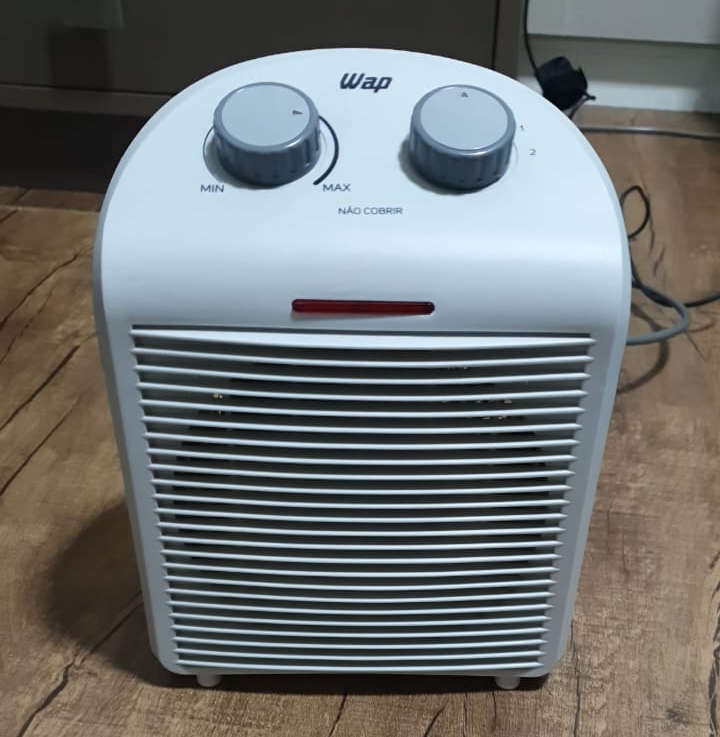

# Itens para venda

## Monitor 4k - R$ 500

- Samsung U28R50
- Resolução 4k
- 28 polegadas
- Defeito: botão que controla todas as funções está quebrado. O monitor está atualmente configurado para usar uma entrada HDMI, e funciona normalmente para essa entrada.

## Braço para monitor - R$ 50 (reservado)

- ELG F80N
- Possui opção de fixação com morsa ou parafuso

## Cama box - R$ 100

- 1,40m x 1,90m x 0,50m
- Acompanha box e o colchão

## Mesa escritório - R$ 50 (reservado)

- 1,20m (comprimento) x 0,60m (largura) x 0,75m (altura)
- Possui um furo para o braço do monitor
- Alguns desgastes leves na parte inferior direita do tampo

## ~~Playstation 4 - R$ 500~~ (vendido)

- Playstation 4 modelo "fat"
- Acompanha 2 controles
- Riscos no console
- Capas dos analógicos de um dos controles estão bastante gastas
- Console e controles funcionam perfeitamente 

## Jogos Playstation 4 - R$ 40 cada

- The Last of Us 2 (reservado)
- Death Stranding
- Final Fantasy XVI
- God of War: Ragnarok (reservado)

## ~~Fone gamer - R$ 50~~ (vendido)

- Marca Warrior
- USB (não tem saída p2)
- Com LED e microfone

## Microfone - R$ 50

- Marca SWL
- Acompanha cabo P10

## Pedestal microfone - R$ 50

## ~~Aquecedor portátil - R$ 50~~ (vendido)

- Marca WAP
- 220v

## ~~Airfryer - R$ 50~~ (vendido)

- Marca Cadence
- 220v

## ~~Aspirador de Pó - R$ 50~~ (vendido)

- Marca Wap
- 220v

## ~~Liquidificador - R$ 50~~ (vendido)

- Oster BLSTMG-BR8
- 220v

## Ventilador - R$ 50

- Marca Britannia
- 220v

## Secador de cabelo - R$ 50

- Mallory
- Bivolt
